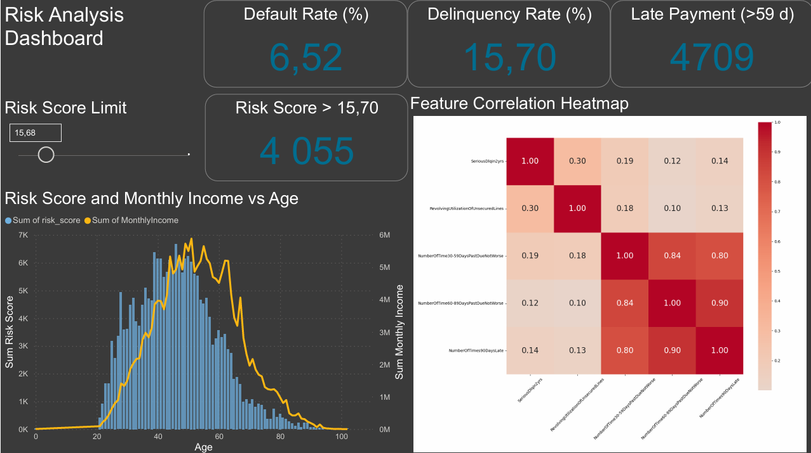

# Bank Risk Early Warning System

Simulating banking risk management to identify emerging credit risks before they breach risk appetite thresholds.

## Dataset
Kaggle dataset - "Give me some credit"

## Features

- Probability of Default model
- Risk scoring engine
- KRI monitoring
- Traffic-light risk appetite framework

## Technologies

- Python
- SQL
- Scikit-Learn
- Pandas
- YAML
- Power BI

## Dashboard

